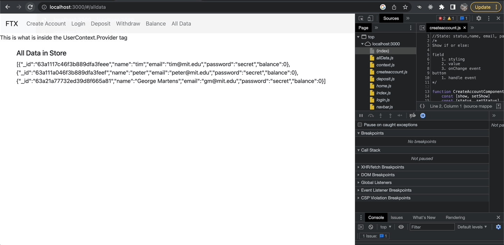

## Bad Bank



### Front End with React

Public Directory

### Back End Node Package Express Server and MongoDB Data Sore

NodeJS Application at the root folder to host code for the server and the connectivity to the data store.

1. Serve Static Files

- Staic Serving

- Files in public directory

- Express

2. Add the Server API

- Routes

- API

3. Front End Calls to Back End

- Packages

- API Calls

4. Data Store

## Node Server

Create public directory, write a node server application with server-side logic, serve the content with Express, and write placeholder routes in the server to align with the existing UI.

```npm init -y```

```npm install express```

```npm install nodemon```

```npm install cors``` Help avoid conflicts while using multiple tiers.

### Index.js for root application

Require the Node Packages.
```
//===Require express and cors====
const express   = require('express');
const app       = express();
const cors      = require('cors');

//===Serve static files from the public directory===
app.use(express.static('public'));
app.use(cors());

//===Route to create new users based on 3 parameters=======
app.get('/account/create/:name/:email/:password', function(req, res) {
    res.send({
        name:       req.params.name,
        email:      req.params.email,
        password:   req.params.password
    });
});

//===Route to login a user based on 2 parameters=======
app.get('/account/login/:email/:password', function(req, res) {
    res.send({
        email:      req.params.email,
        password:   req.params.password
    });
});

//===Route to view data store=======
app.get('/account/all', function(req, res) {
    res.send({
        name:       'mark',
        email:      'mark@mit.edu',
        password:   'secret'
    });
});

const port = 3000;
app.listen(port);
console.log('running on port: ' + port);
```

## Data Store

There are two types of data stores. In a relational data store, data is represented in tables. In a document data store, data is thought of as a document. This course focuses on document databases like MongoDB. 

A document database is better for unstructured data, and the application logic is usually easier to write than for a relational database. Watch the video to review examples of documents, collections of documents, and queries for manipulating a document database.

Document Store

    - Documents are independent units
    - Application logic is easier to write
    - Unstructured data can be stored easily

### Non-relational Databases

A non-relational database does not use tables and columns to store data. Instead, its storage model is optimized for the type of data it’s storing. Non-relational databases are also known as NoSQL databases, which stands for Not Only SQL. Whereas relational databases only use SQL, non-relational databases can use other types of query languages.

### There are four different types of NoSQL databases: 

- Document-oriented databases
- Key-value stores 
- Wide-column stores 
- Graph stores 

This course focuses on document-oriented databases, also known as document stores. Document databases pair each key with a complex data structure called a document. 

### Here’s an example of a document store:

key1
```
{
 “studentId”: 1, 
 “studentName”:”john”,
 “courseList”: 
       {
          “courseId”: c1
          “courseName: “JAVA”
       }
}
```

key2
```
{

 “studentId”: 2, 

 “studentName”:”Emma”,

 “courseList”: 

       {

          “courseId”: c2

          “courseName: “HTML”

       }

}
```
### Popular document-oriented databases include:

- MongoDB
- RedisDB

### Advantages Of Non-relational Databases

Modern applications impose requirements that are not addressed by relational databases. This has driven the development of NoSQL databases that offer the following:

- A flexible data model: NoSQL databases offer flexible data models that make it easy to store and combine data in any structure and allow the dynamic modification of the data structure without impacting the application.

- Scalability and Performance: NoSQL databases were all built with a focus on scalability. This allows the database to scale out on hardware deployed on-premises or in the cloud and thus enables almost unlimited growth with higher throughput and lower latency than that offered by relational databases.

### Disadvantages of Non-relational Databases:

- Structure and Consistency: Because non-relational databases don’t require a predefined data structure, they are not well suited for use cases that require consistent, structured data.  

- Enterprise applications: Legacy enterprise systems and teams are often to expect a specific data structure from a relational database. It would be difficult to adapt these systems to rely on a non-relational database. 

### What Type of Database Should You Use?

Ultimately, the choice of database depends on the data structure, data size, and how the data will be used and analyzed. However, a recommended starting point is to answer these questions:

- Which type of data will you be storing?  Does your data fit into rows and columns, or is it better suited to a more flexible structure?  

- How much data are you handling? The bigger the data set, the more likely a non-relational database is a better fit. Non-relational databases can store large amounts of data and give you the flexibility to change the data type at any point without breaking the database model.

In this course, you’ll be focusing on NoSQL databases, as these offer the flexibility needed when developing MERN applications.

Use [MongoDB](https://www.mongodb.com/) as a document database and run it inside of a Docker container. Start by creating a test instance to confirm that MongoDB is working. 

Step 1 - download [Robo 3T](https://robomongo.org/) which is an open-source GUI for MongoDB.

Step 2 - Create a Docker image named badbank.

```
# docker image for mongodb
# This image includes EXPOSE 27017 (the mongodb port),
# so standard container linking will make it
# automatically available to the linked containers
$ docker run -p 27017:27017 --name badbank -d mongo
```
Check to make sure the image was created.

```
docker ps
```

Step 3 - Create a Standalone Node Client - make the connection to MongoDB to confirm access and permissions.

```
npm install mongodb
```

- Create mongo_test.js file

```
const MongoClient = require('mongodb').MongoClient;
const url = 'mongodb://localhost:27017';

MongoClient.connect(url, {useUnifiedTopology: true}, function(err, client) {
    console.log('Connected')

    //database Name
    const dbName = 'myproject';
    const db = client.db(dbName);

    //new user
    const name = 'user' + Math.floor(Math.random()*10000);
    const email = name + '@mit.edu';

    //insert into customer table
    const collection = db.collection('customers');
    const doc = {name, email};
    collection.insertOne(doc, {w:1}, function(err, result) {
        console.log('Document insert');
    });

    //read back database contents
    const customers = db
        .collection('customers')
        .find()
        .toArray(function(err, docs) {
            console.log('Collection:', docs);

            //clean up and close the connection
            client.close();
        });
});
```

### Connect Express And MongoDB

MongoClient functions in the official [MongoDB documentation](https://mongodb.github.io/node-mongodb-native/api-generated/collection.html#findone) to understand how each of the methods work.

Write a data abstraction layer (DAL) package so you can separate your database-specific code from your node application. If you decide to change databases in the future, the DAL will make it easy to update your code without major changes to the rest of the application. 

Here, you’ll use promises to wrap calls between the database, DAL, and front end. Write the Create Account route in the DAL along with the video, then develop the remaining routes on your own.

### Promise Wrapper on Calls to Database

```
//=====Data Abstraction Layer (DAL)=============================
function create(name, email, password) {
    return new Promise((resolve, reject) => {
        const collection = db.collection('users');
        const doc = {name, email, password, balance: 0};
        collection.insertOne(doc, {w:1}, function(err, result) {
            err ? reject(err) : resolve(doc);
        )};
    });        
}
```

//=======Node Express Application==============================
// create user accout
app.get('/account/create/:name/:email/:password', function (req, res) {
    dal.create(
        req.params.name,
        req.params.email,
        req.params.password
        ).then((user) => {
            console.log(user);
            res.send(user);
        });
});
```

## Front End - Connect Routes in the Express Application

Refactor your front end so you can connect it to the back end. Follow along with Dr. Sanchez to connect the back-end routes to the Create Account and All Data components. After watching the video, build out the connections for the rest of the components.

Create Accout Before Refactoring
```
function handle() {
    console.log(name,email,password);
    ctx.users.push({name,email,password});
    props.setShow(false);
}
```
Create Account After Refactoring
```
function handle(){
    console.log(name,email,password);
    //call to the backend route!
    const url = `account/create/${name}/${email}/${password}`;
    (async () => {
        const res   = await fetch(url);
        const data  = await res.json():
        console.log(data);
    })();
    props.setShow(false);
}
```

All Data Before Refactoring

```
function AllData(){
    const ctx = React.useContext(UserContext);

    return (
        <>
            <h5>All Data in Store</h5>
            {JSON.stringify(ctx)}<br/>
        </>
    );
}
```

All Data After Refactoring

```
function AllData(){
    const [data, setData] = React.useState('');

    React.useEffect(() => {
        //fetch all accounts API
        fetch('/account/all')
            .then(response => response.json())
            .then(data => {
                console.log(data);
                setData(JSON.stringify(data));
            });
    }, []);

    return (
        <>
            <h5>All Data in Store</h5>
                {data}
        </>
    );
}
```

Refresh the collections in the Studio 3T app to see the new documents added to MongoDB.

## Authentication

Modern applications are built with security in mind. One critical aspect of security is identity management. Your application needs to know who its users are and what they’re allowed to do. This is defined through authentication and authorization:

- Authentication confirms that users are who they say they are. 

- Authorization gives those users permission to access a specific resource or to perform a specific action. 

### Authentication

Authentication is the act of validating that users are who they claim to be; it is the first step in any security process. Some examples of authentication are:

- Giving someone permission to download a particular file on a server.

- Providing individual users with administrative access to an application.

- You can implement authentication in your application using  Firebase. 

### Authorization

Authorization is the process of giving the user permission to access a specific resource or action in the application. This term is often used interchangeably with the terms access control or client privilege. In secure environments, authorization must always follow authentication: users should first prove that their identities are genuine before they are granted access to the requested resources.

Although they sound similar, authentication and authorization are separate steps in the log-in process. Understanding the difference between the two is key to successfully implementing a secure application.

### Where Should You Start?

When refactoring the bad bank application to make it more secure, you will need to implement both authentication and authorization. You can use Firebase to define these processes for both the back end and front end of your application.

To implement authentication and authorization in your assignment, you should:

- Decide which authentication method best suits each layer of your application. 

- Secure your Express back end. (You can examine resources describing this process within the official [Firebase documentation](https://firebase.google.com/docs/admin/setup).)

- Restrict access to resources by managing user roles on the server. You can also add middleware to your back end in order to check user roles.


